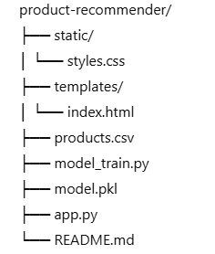
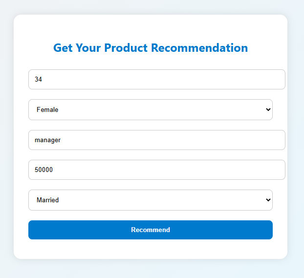
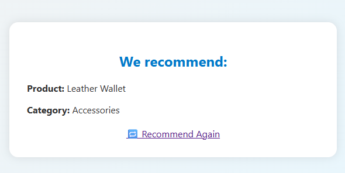

# Product Recommendation System

This is a user-friendly, colorful, and web-based Product Recommendation System powered by a Random Forest machine learning model. It predicts the best product category for users based on input features such as age, gender, occupation, and income.

## Table of Contents

- [Overview](#overview)
- [Features](#features)
- [Technologies Used](#technologies-used)
- [Project Structure](#project-structure)
- [Getting Started](#getting-started)
- [How It Works](#how-it-works)
- [Screenshots](#screenshots)
- [Future Enhancements](#future-enhancements)
- [License](#license)

## Overview

This project demonstrates how to build an end-to-end machine learning product recommendation engine using the Random Forest algorithm. It includes:

- A Python script to train and save the model (`model_train.py`)
- A Flask backend server (`app.py`)
- A modern and responsive front-end interface using HTML and CSS

## Features

- Predicts product categories based on user inputs
- Built using Random Forest classifier
- Interactive and responsive web UI
- Supports custom product datasets (`products.csv`)
- Easy to extend and customize

## Technologies Used

- Python
- Scikit-learn
- Flask
- HTML5
- CSS3 (with Flexbox)
- Pandas and NumPy

## Project Structure

## Getting Started

Follow these steps to run the project on your local machine.

### Prerequisites

- Python 3.7+
- `pip` installed

### Install Dependencies

pip install flask pandas scikit-learn

## Train the Model

python model_train.py
This will create a model.pkl file.

## Run the App

python app.py
Visit http://localhost:5000 in your browser.

## How It Works
 - The user enters personal details (age, gender, occupation, income).

 - The Flask backend passes the data to the pre-trained Random Forest model.

 - The model returns the predicted product category.

 - The front-end displays the result in a visually appealing format.

## UI PREVIEW

## The input form

## The result screen

## Future Enhancements
  - Add database support to store user recommendations

  - Add login/authentication system

  - Use more advanced models like XGBoost or Neural Networks

  - Add analytics dashboard for insights

